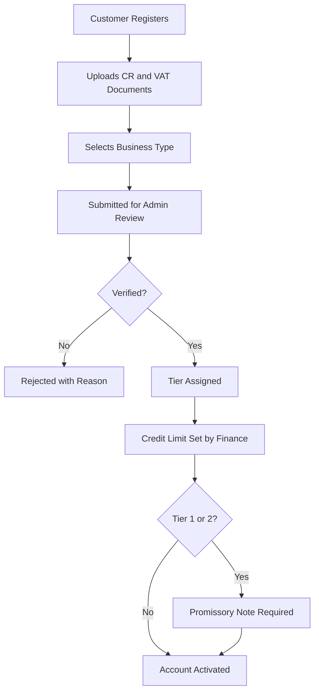
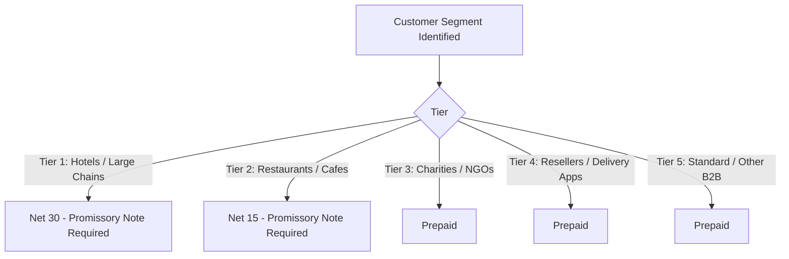
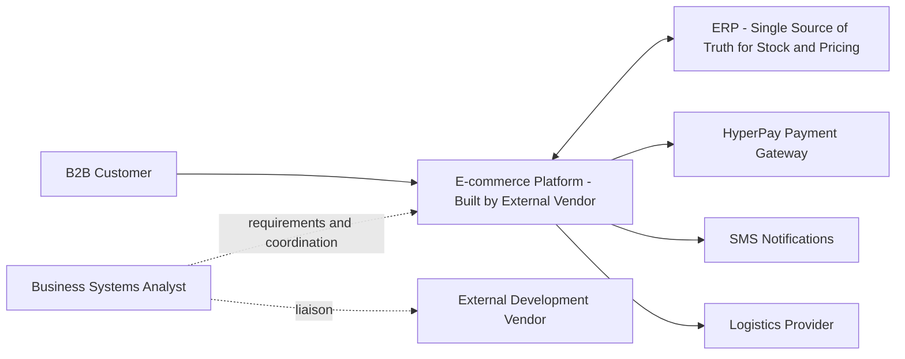
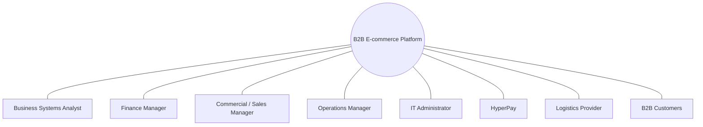

# B2B E-commerce Implementation

---

## Overview

Business-side design and delivery of a B2B e-commerce platform extending an established multi-branch FMCG operation into a digital ordering channel. Integrated with the live ERP for real-time inventory and pricing, HyperPay for payment processing, and a logistics provider for fulfillment. The platform served verified B2B customers exclusively, replacing physical-only wholesale ordering with 24/7 self-service.

---

## Business Context

Wholesale ordering had previously been physical-only: customers visited a branch in person, submitted a paper draft, waited on manual picking, and received a manually adjusted invoice, with no self-service option and no ability to order outside business hours. Following the ERP implementation that gave the business reliable real-time inventory and pricing data, the organization moved to extend that same operational foundation into a digital B2B ordering channel.

---

## Business Objectives

- Enable 24/7 digital ordering for verified B2B customers.
- Reduce manual wholesale order handling by shifting volume to the digital channel.
- Enforce tiered pricing digitally, correctly applied per verified customer segment.
- Prevent orders below regional minimum thresholds.
- Maintain real-time inventory accuracy between the platform and the ERP, eliminating online oversell.
- Restrict ordering to verified B2B accounts only.
- Enforce credit terms structurally: net terms for lower-risk tiers, prepayment for higher-risk tiers.

---

## Project Scope

- 8,000+ active SKUs.
- 5-tier customer segmentation and pricing engine.
- Real-time ERP inventory and pricing integration. The ERP remained the single source of truth; no platform-side stock table.
- HyperPay payment gateway integration (MADA, Visa, Mastercard, Apple Pay).
- Regional delivery rules with minimum order and delivery fee logic.
- Logistics API integration for fulfillment tracking.
- Customer registration and verification workflow (CR + VAT upload, business type classification, tier assignment).
- B2C-ready architecture built but left inactive: configuration-only future activation, not part of this project's active scope.

**Out of scope:** B2C activation, native mobile app, platform-side inventory management, AI-driven pricing.

---

## My Role

**Title:** Business Systems Analyst
**Company:** Mohd. Saeed Balbid Company
**Duration:** Feb 2023 – May 2025 (formal project start, aligned with vendor contracting; sequential to, not concurrent with, the Multi-Branch ERP Implementation)

My involvement began before the formal project start. During the preceding period, following the ERP implementation, I studied and scoped the planned digital commerce channel ahead of the formal engagement, positioning me as part of the decision to pursue the project, not only its later execution. Once the project formally started, aligned with vendor contracting, the platform itself was built by an external service provider. This was a vendor-led development effort, not an internal build. My responsibility was designing the order lifecycle, pricing model, and delivery rules based on requirements gathered through stakeholder workshops and business discussions, then coordinating with the vendor and technical team through testing and launch to ensure those requirements were implemented correctly.

---

## Requirements & Stakeholder Alignment

Requirements were gathered through stakeholder workshops and business discussions, covering the commercial, finance, and operational functions the platform needed to serve. Core requirements translated directly into platform design decisions: verified-only B2B access (no self-registration into an active account), tier-based pricing and credit terms, region-based delivery logic, and real-time dependency on the ERP for both stock and pricing data, deliberately avoiding a duplicate, platform-side inventory record that could drift out of sync.

---

## Product & Pricing Design

### Catalog Structuring
The product catalog covered 8,000+ active SKUs, sourced live from the ERP rather than maintained separately on the platform. Any stock or pricing change in the ERP reflected immediately on the platform.

### Pricing Model
A 5-tier pricing structure was designed, mapped to customer risk and payment terms rather than a flat wholesale discount:

| Tier | Segment | Payment Terms |
|---|---|---|
| Tier 1 | Hotels / Large F&B Chains | Net 30 days |
| Tier 2 | Restaurants / Cafes | Net 15 days |
| Tier 3 | Charities / NGOs | Prepaid |
| Tier 4 | Resellers / Delivery Apps | Prepaid |
| Tier 5 | Standard / Other B2B | Prepaid |

Net-term tiers (1–2) required a promissory note before activation; prepaid tiers did not. Credit exceeded on a net-term account blocked the order at checkout, mirroring the same credit control principle already enforced in the ERP.

### Delivery Rules
Delivery logic was defined by region rather than a flat nationwide rate. Minimum order value, delivery fee, and free-delivery threshold each varied by region, with fees calculated automatically at checkout rather than entered manually.

---

## Vendor-Led Development & Coordination

The platform was developed by an external service provider. My role throughout the build was to act as the business-side owner of the requirements, translating stakeholder input into specifications the vendor could build against, reviewing implementation against those specifications, and escalating gaps. Backlog and issue tracking with the vendor was managed through Jira.

---

## Integrations

- **ERP Integration:** Real-time stock and pricing feed; the ERP remained the single source of truth for both.
- **HyperPay:** Payment gateway integration supporting MADA, Visa, Mastercard, and Apple Pay for prepaid-tier checkout.
- **SMS Integration:** Coordinated as part of the platform's customer communication capability.

Each integration was coordinated with the vendor and validated as part of the testing phase below.

---

## Testing & Quality Assurance

I coordinated UAT with business users and also performed hands-on testing myself to validate business processes and system functionality, not solely relying on the vendor's own QA. I participated directly in the Go/No-Go decision ahead of launch, and acted as the primary liaison between business stakeholders, the external service provider, and the technical team to ensure business requirements were correctly implemented and that issues were resolved before production deployment.

---

## Launch

The platform launched as the digital extension of the existing wholesale channel, restricted to verified B2B accounts from day one. No open self-service registration into an active, ordering-capable account.

---

## Post-Launch Optimization

Not documented in PKB or confirmed by Omar beyond initial launch. Any post-launch iteration, feature changes, or optimization activity should be added here only once confirmed, currently marked as an open item rather than filled in.

---

## Visual Documentation

*Diagrams below reflect only flows and structure confirmed in this dossier's Evidence Mapping.*

### Business Process Flow: Registration & Verification

### Business Rule Decision Flow: Pricing & Credit Tier

### High-Level Business Architecture

### Stakeholder Map

### Delivery Stage Sequence

*Reflects confirmed stage order only. No specific internal stage dates are documented beyond the confirmed project period (Feb 2023 to May 2025).*

### Before vs. After: Wholesale Ordering

| Aspect | Before (Physical-Only) | After (Digital Platform) |
|---|---|---|
| Ordering Hours | Business hours only | 24/7 |
| Process | In-person visit, paper draft | Self-service digital ordering |
| Staff Involvement | Required for every order | Not required per order |
| Order History Access | Not available to customer | Available in customer portal |

---

## Business Outcomes

- Digitized the B2B ordering process, replacing a physical-only wholesale journey with a self-service digital channel.
- Improved inventory synchronization between the platform and the ERP.
- Reduced manual order processing.
- Created a scalable platform supporting future business growth.
- Supported business operations involving more than 500 B2B customers.
- Implemented a 5-tier pricing model.
- Defined 4 regional delivery zones.

**Note on unverified targets:** The project's KPI framework (order volume growth, payment success rate, inventory sync accuracy, cart abandonment rate, and similar figures) exists as a baseline-to-target table in supporting documentation. None of these have been confirmed by Omar as measured, achieved outcomes. They are treated as **Proposed TO-BE Targets**, not results, and are excluded from this Business Outcomes section pending confirmation.

---

## Skills Demonstrated

- B2B E-commerce Platform Requirements Design
- Order Lifecycle and Pricing Model Design
- Regional Business Rule Design (delivery logic)
- Vendor Management and Coordination
- Cross-functional Liaison (business, vendor, technical team)
- UAT Coordination and Hands-on Testing
- Go/No-Go Launch Decision Participation
- ERP-to-Platform Integration Coordination (ERP, HyperPay, SMS)
- Jira Backlog Management

---

